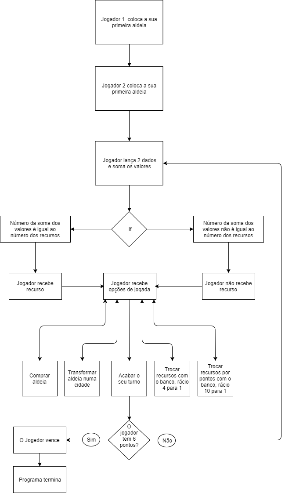

**2º Projecto de Introdução à Computação 2018/2019**

> Madalena Marcelino *a21700859*
> Afonso Rosa *a21802169*

**Solução**

Para a organização e simplicidade do código foram utilizados:
* Structs de modo a definir várias variáveis sob um nome dentro de um bloco de memória;
* Switch cases de modo a simplificar as escolhas e opções do jogador;
* Fors de modo a gerir os numeráveis parâmetros que influenciam o que o jogador pode ou não fazer;  
* Ifs de modo a simplificar as "permissões do jogador";
* Pointers para se poder aceder às structs previamente definidas. 

Fluxograma da nossa versão do jogo "Settlers of Catan:

**estruturas de dados:**
*Estructura utilizada para os territórios

**Manual do Utilizador**

Como compilar:
* Começar por meter no terminal:
* -> gcc -std=c99 -g -Wall -Wextra -Wpedantic -o catan catan.c 
* Seguido por:
* -> ./catan

* Regras do jogo:

	Este jogo é um jogo turn based que ocorre num mapa 2D, cada 
posição no mapa tem terrenos 
adjacentes a Norte(N), a Sul (S), a Este 
(E) e a Oeste (O) que produzem recursos naturais e que estão associados 
a números. Estes recursos são: Wool (W), Brick (B), Lumber (L), Grain 
(G), Iron (I) ou Desert (D). 
	Este jogo é um jogo competitivo para duas pessoas, para ganhar é 
necessário que um dos jogadores acumule 6 pontos.
	No ínicio do jogo cada jogador escolhe um local para instalar a 
sua primeira aldeia (o jogador 1 escolhe primeiro a posição da sua 
aldeia, seguido de o jogador 2, cada posição só pode pertencer a um 
único jogador), em cada ronda, o jogador lança 2 dados. Todos os 
jogadores que tenham aldeias em posições com terrenos adjacentes cujo 
número seja igual à soma dos 2 dados, ganham uma carta com os recursos 
naturais produzidos pelos terrenos adjacentes.
	Quando chega a sua vez, o jogador, é obrigado a lançar os dados 
antes de fazer qualquer outra acção, depois de os mesmos terem sido 
lançados podem ser tomadas as seguintes acções, até que os seus recursos o permitam:

* Comprar uma aldeia e colocá-la numa posição adjacente;
* Transformar uma aldeia sua numa cidade. As cidades produzem duas 
unidades de recursos naturais em vez de uma;
* Efectuar uma troca com o banco ao rácio de 4 para 1, o jogador pode 
trocar 4 unidades do mesmo recurso natural, por uma que necessite de 
outro recurso;
* Efectuar uma troca com o banco ao rácio de 10 para 1, o jogador pode 
trocar 10 unidades do mesmo recurso natural, por 1 ponto (o jogo 
acaba quando um jogador chega a 6 pontos);
* Passar a sua vez ao outro jogador. 

Preços de construcção de aldeias e de cidades:

* Aldeia -> 1 B  +  1 L  +  1 G  +  1 W
* Cidade -> 2 G  +  3 I

* Cada aldeia vale 1 ponto e cada cidade vale 2 pontos. 

**Conclusões e matéria aprendida**

* Melhoramento do conhecimento de C, incluíndo a melhor utilização de structs;
* Conhecimento sobre a criação de doxyfiles;
* Conhecimento sobre uma versão do jogo "Settlers of Catan".

**Referências**

* Este trabalho tirou várias referencias no que foi dado nas aulas da 
UC, e as dúvidas restantes foram retiradas ou com colegas ou pesquisadas 
na internet.

As bibliotecas utilizadas foram: 
* #include <stdio.h>
* #include <stdlib.h>
* #include <time.h>
* #include <ctype.h>

